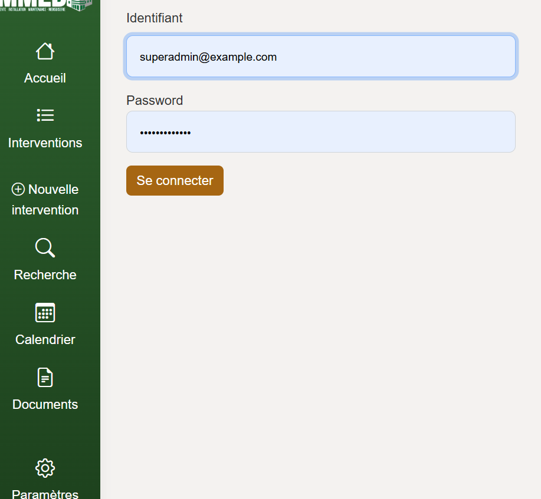
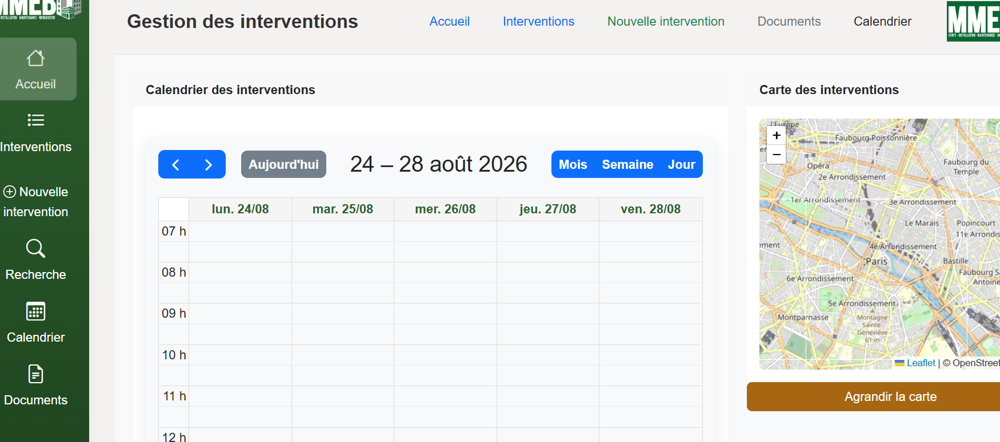
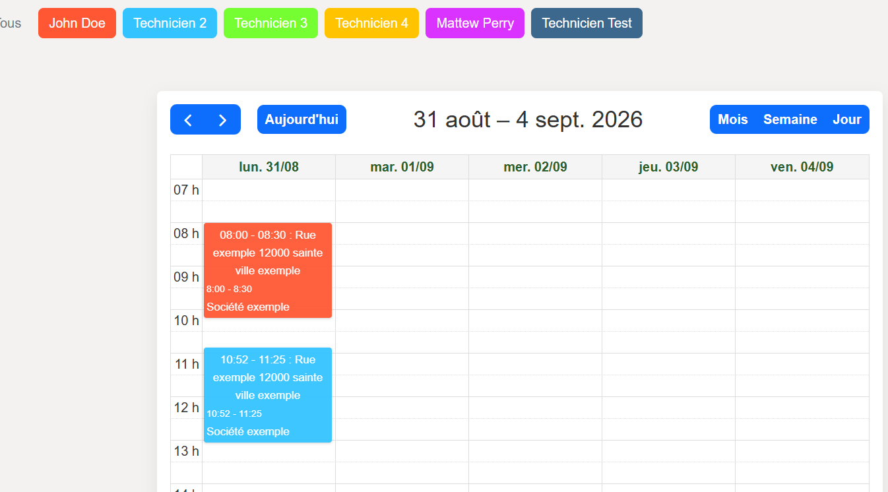
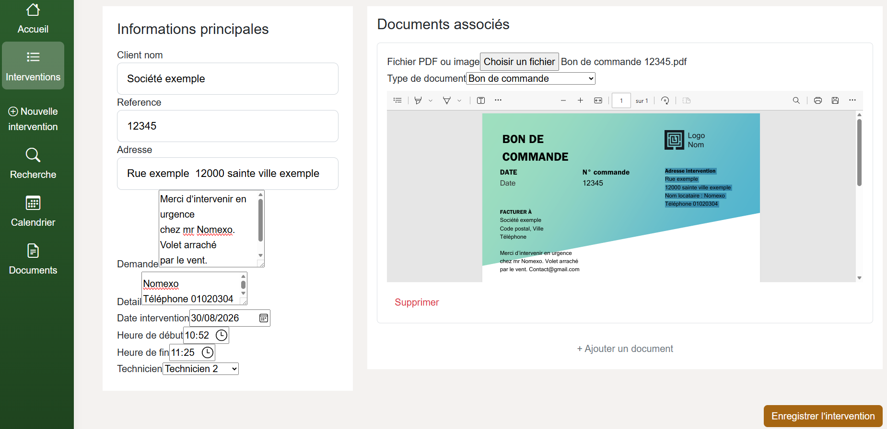
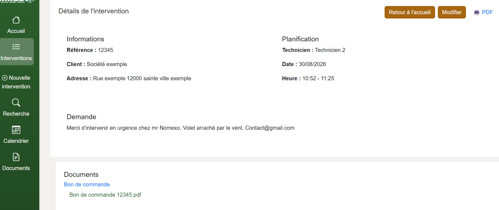
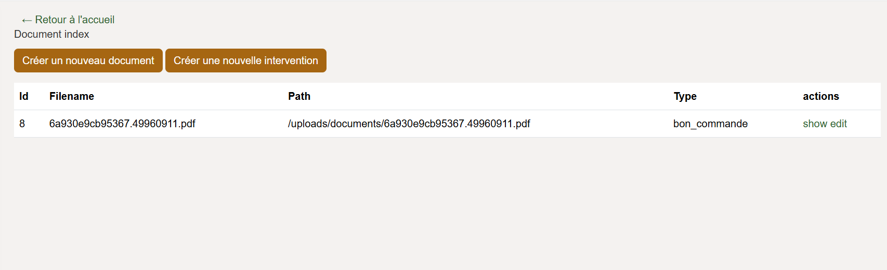
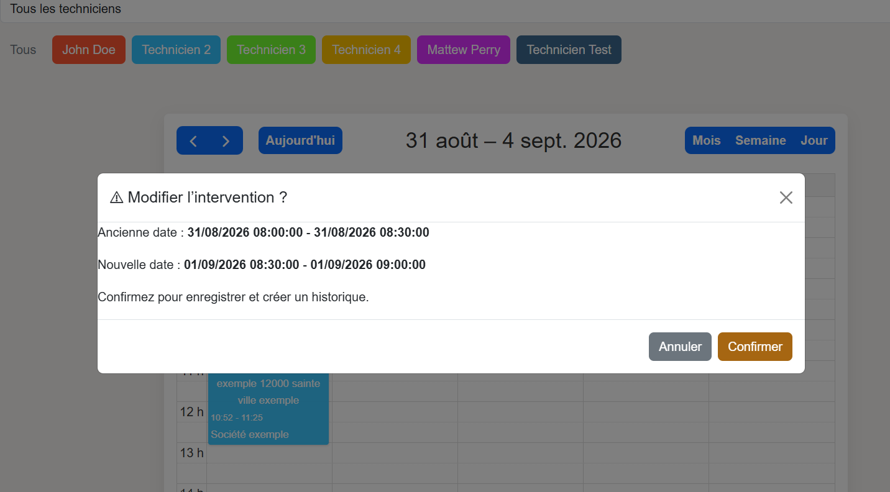
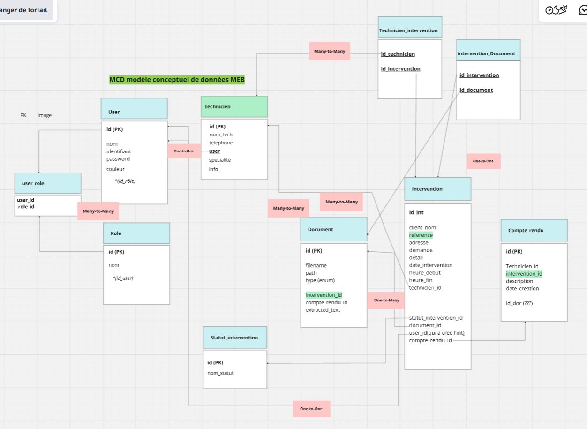

MEB-App

Application web de gestion des interventions et des plannings pour une entreprise de menuiserie.

MEB App est une application web développée avec Symfony dans le cadre d'un projet personnel.
Elle permet de centraliser les interventions techniques, leurs documents associés, les techniciens et leur planning.

Le projet met notamment en œuvre une gestion des  utilisateurs et des rôles, une création et suivi des interventions, un système de planification, une gestion documentaire avec extraction de texte depuis les PDF ainsi qu'un historique des modifications des interventions.

🚧 Projet personnel en cours de développement.
L'application est fonctionnelle sur plusieurs parcours principaux, mais certaines fonctionnalités et améliorations restent à réaliser. 
Documentation:
Les éléments complémentaires du projet sont disponibles dans :
docs/

**Stack technique 
backend :  Symfony · PHP · Doctrine · MySQL 
frontend: Twig · JavaScript · SCSS 
Bibliothèques :  FullCalendar -gestion du planning · Flatpickr - selection des dates et heures· PDF.js - affichage des documentsPDF · Leaflet - cartographie · Bootstrap

Aperçu

Conception

Le projet repose sur une base de données relationnelle permettant notamment de gérer les relations entre les utilisateurs, les rôles, les techniciens, les interventions, les documents, les comptes rendus et l'historique des modifications.

Les éléments complémentaires de conception et de présentation sont disponibles dans le dossier docs/.
Un dump MySQL de démonstration est fourni avec le projet:
(meb_app_demo.sql)

Il contient :

la structure complète de la base de données ;
les tables et leurs relations ;
les rôles utilisateurs ;
des comptes de démonstration fictifs.

Les données métier utilisées pendant le développement n'ont pas été conservées dans ce dump.

Aucune donnée réelle de client ou document réel n'est nécessaire pour faire fonctionner la démonstration locale.

La base fournie contient la structure nécessaire à l'application ainsi que des comptes de démonstration fictifs.
Installation
1. Cloner le projet
git clone [https://github.com/greenleendeen/meb_app.git]
2. Installer les dépendances PHP
composer install
3. Installer les dépendances JavaScript
npm install
4. Configurer la base de données

Créer une base MySQL nommée meb_app.

Configuration locale utilisée :

Utilisateur : root
Mot de passe : aucun
Port : 3307
Adapter la variable DATABASE_URL du fichier .env.local à votre environnement local.

Dans la base de données meb_app importer le fichier :
meb_app_demo.sql

5. Lancer le serveur Symfony
symfony server:start

npm install
npm run dev

Comptes de démonstration

Les fixtures fournissent plusieurs profils fictifs et permettent de tester les différents rôles de l'application. Des fixtures sont également disponibles dans le projet pour faciliter les tests et le développement.:

Profil	            Identifiant	                Mot de passe
Super Admin	        superadmin@example.com	    superpassword
Administrateur	    admin@example.com	        adminpassword
Technicien	        tech@example.com	        techpassword

Ces comptes sont uniquement destinés aux tests et à la démonstration de l'application en local.

Tester l'application

Quelques fonctionnalités actuellement disponibles :

Se connecter avec un compte administrateur.
Consulter et gérer les interventions.
Consulter le planning en tant que technicien.
Consulter les documents associés aux interventions.
Tester l'ajout d'un document fictif.
À venir

Le projet est encore en développement et de nouvelles fonctionnalités sont prévues.